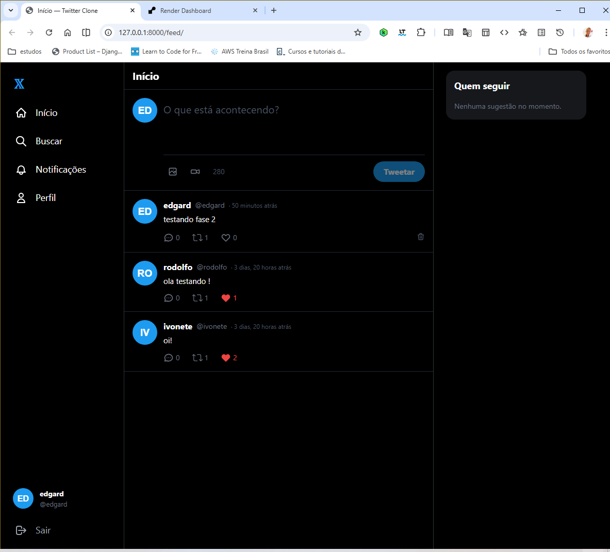
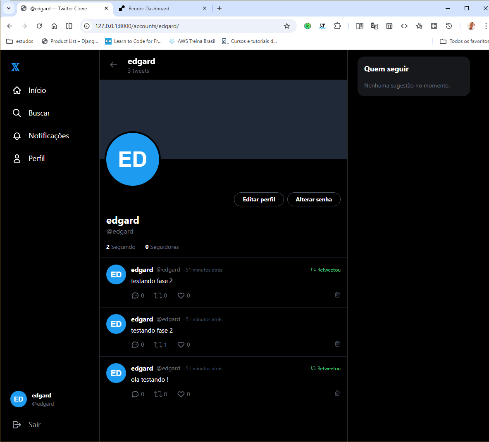

# 🐦 Twitter Clone — Projeto Final EBAC

Clone funcional do Twitter construído com **Django monolítico + Tailwind CSS**.

## 📸 Preview

| Feed | Perfil |
|------|--------|
|  |  |

## 🌐 Deploy
👉 **[Acessar aplicação](https://ebac-projeto-final-clone-twitter.onrender.com)**

---

## ⚙️ Stack

| Camada | Tecnologia |
|--------|-----------|
| Back-end | Python 3.11 + Django 4.2 |
| Front-end | HTML + Tailwind CSS (CDN) + JavaScript (Fetch API) |
| Banco de dados | PostgreSQL (produção) / SQLite (desenvolvimento) |
| Arquivos estáticos | WhiteNoise |
| Servidor produção | Gunicorn |

---

## ✅ Funcionalidades

- ✅ Cadastro e login seguro
- ✅ Edição de perfil (nome, bio, foto, capa) — todos os campos opcionais
- ✅ Alteração de senha
- ✅ Sistema de seguir/deixar de seguir (AJAX)
- ✅ Feed inteligente (só mostra quem você segue + seus próprios tweets)
- ✅ Criação de tweets com imagem ou vídeo
- ✅ Curtidas (AJAX, sem recarregar a página)
- ✅ Retweets com toggle (AJAX)
- ✅ Comentários (AJAX)
- ✅ Central de notificações (likes, comentários, retweets, follows)
- ✅ Badge de notificações não lidas no menu
- ✅ Dark mode nativo

---

## 🚀 Como rodar localmente

### 1. Clone o repositório

```bash
git clone https://github.com/helbert-guirra/EBAC-Projeto-Final-clone-Twitter.git
cd EBAC-Projeto-Final-clone-Twitter
```

### 2. Crie e ative um ambiente virtual

```bash
python -m venv venv

# Windows:
venv\Scripts\activate

# Linux/Mac:
source venv/bin/activate
```

### 3. Instale as dependências

```bash
pip install -r requirements.txt
```

### 4. Configure as variáveis de ambiente

```bash
copy .env.example .env
# Edite o .env com sua SECRET_KEY
```

### 5. Rode as migrations e inicie o servidor

```bash
python manage.py migrate
python manage.py runserver
```

Acesse em: **http://127.0.0.1:8000**

---

## Autor

**Helbert Guirra** — EBAC Projeto Final